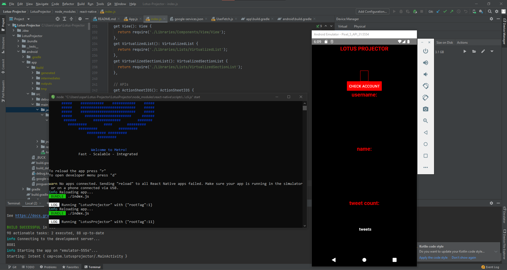

# Lotus-Projector
The repository for Daniel Paganelli and Sunwoo Park's Senior Design Mini-project.
The goal is to implement an app that can estimate the likelihood of an inputted twitter profile being a bot.
Upon user input of an existing Twitter handle, our app uses the Twitter API v2 and the Fetch API
in order to return a list of metrics regarding the user (e.g. username, display name, number of tweets).

# Screenshots

  

 

Above is a screenshot of the main page/screen of our app when it's first launched.

  

 

Above is a screenshot of the screen which refreshes to show the metrics of @abc when the username
is entered into our app.

  

 

Above is a screenshot of the screen which refreshes to show the metrics of @abc when the username
is entered into our app.